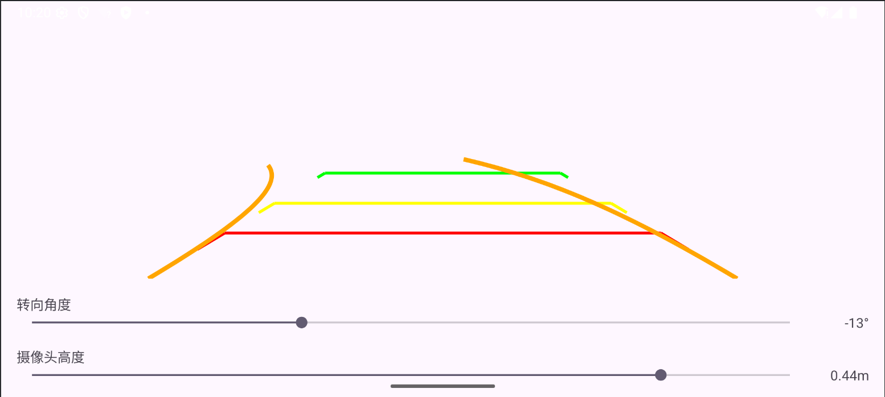

# RobotGuidelineApp - Android 行车引导线演示应用

这是一个 Android 示例应用程序，旨在演示如何在屏幕上绘制行车引导线，帮助用户或机器人进行车辆定位和引导。本应用可以模拟在不同场景下，根据车辆位置和方向实时生成并显示引导线的效果。

## 目录

* [功能特性](#功能特性)
* [截图预览](#截图预览)
* [安装与运行](#安装与运行)
* [技术栈](#技术栈)
* [项目结构](#项目结构)
* [贡献](#贡献)
* [许可证](#许可证)

## 功能特性

* **实时引导线绘制：** 根据模拟的车辆位置和姿态，在屏幕上动态绘制引导线。
* **可配置的引导线样式：** （如果您的Demo支持）支持调整引导线的颜色、粗细、类型（例如虚线、实线）。
* **模拟车辆运动：** （如果您的Demo支持）可以通过用户输入或预设路径模拟车辆的移动，观察引导线随之变化。
* **直观的用户界面：** 简洁的界面展示引导线效果。
* **基于 Android 平台：** 兼容主流 Android 设备。

## 截图预览

以下是 RobotGuidelineApp 的运行截图：



## 安装与运行

### 前提条件

* Android Studio (推荐最新稳定版)
* Android SDK (API Level 21 或更高，具体取决于您的 `build.gradle` 配置)
* 一台 Android 设备或模拟器

### 步骤

1.  **克隆仓库：**
    ```bash
    git clone [https://github.com/conner1983/RobotGuidelineApp.git](https://github.com/conner1983/RobotGuidelineApp.git)
    cd RobotGuidelineApp
    ```

2.  **在 Android Studio 中打开项目：**
    * 启动 Android Studio。
    * 选择 "Open an existing Android Studio project" 或 "File" -> "Open...".
    * 导航到您克隆的 `RobotGuidelineApp` 目录并选择它。

3.  **同步项目：**
    * Android Studio 可能会自动同步 Gradle。如果需要，请点击 "Sync Project with Gradle Files" 按钮。

4.  **运行应用：**
    * 连接您的 Android 设备，并确保已开启 USB 调试模式。
    * 或创建一个 Android 模拟器。
    * 在 Android Studio 工具栏中，选择您的设备/模拟器。
    * 点击 "Run 'app'" 按钮（绿色的播放图标）。

## 技术栈

* **语言：** Java / Kotlin (根据您的实际代码情况选择，如果主要是Java，就写Java)
* **平台：** Android
* **核心库：** Android SDK
* **绘图：** Android Canvas API / Custom View

## 项目结构
RobotGuidelineApp/
├── app/
│   ├── src/
│   │   ├── main/
│   │   │   ├── java/com/yourcompany/robotguidelineapp/ (或您的包名)
│   │   │   │   ├── MainActivity.java (主活动)
│   │   │   │   ├── GuidelineView.java (自定义视图，用于绘制引导线)
│   │   │   │   └── ... (其他类文件)
│   │   │   ├── res/ (资源文件：布局、图片等)
│   │   │   └── AndroidManifest.xml
│   ├── build.gradle
├── demo.png              <-- 您的截图文件
├── README.md             <-- 本文件
└── ... (其他 Gradle 或项目配置文件)


## 贡献

欢迎任何形式的贡献！如果您有改进建议、发现了 Bug 或想添加新功能，请随时：

1.  Fork 本仓库。
2.  创建您的特性分支 (`git checkout -b feature/AmazingFeature`)。
3.  提交您的更改 (`git commit -m 'Add some AmazingFeature'`)。
4.  推送到分支 (`git push origin feature/AmazingFeature`)。
5.  打开一个 Pull Request。
